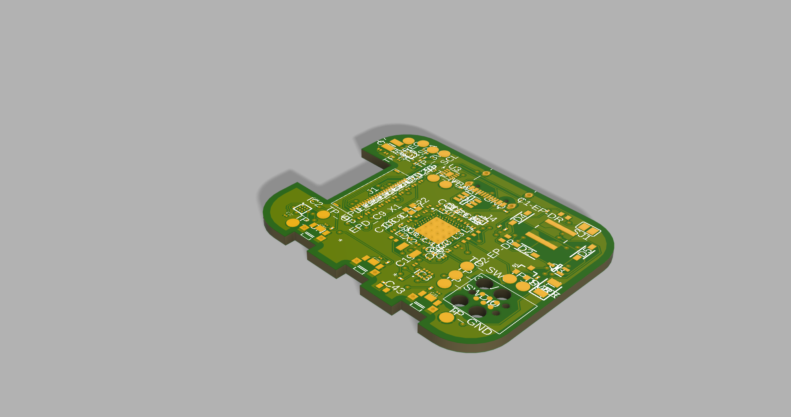
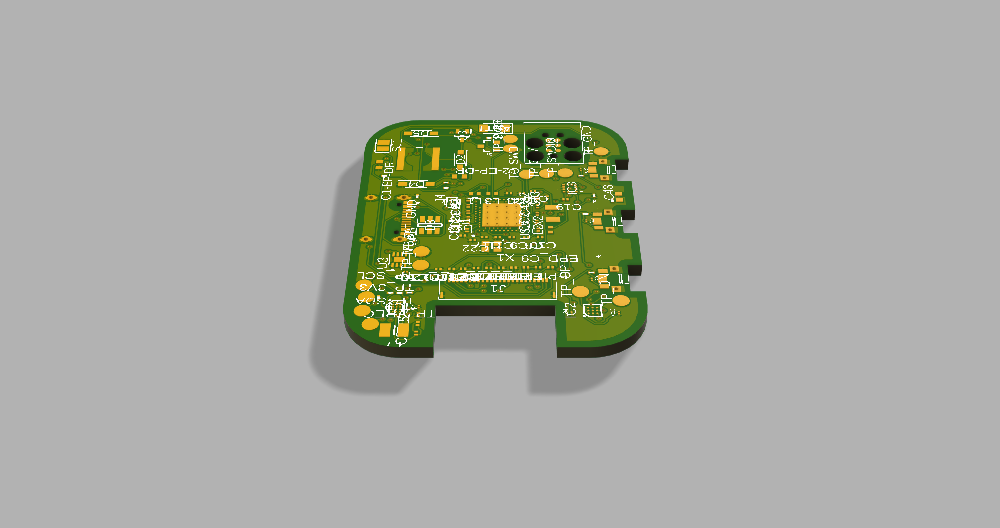
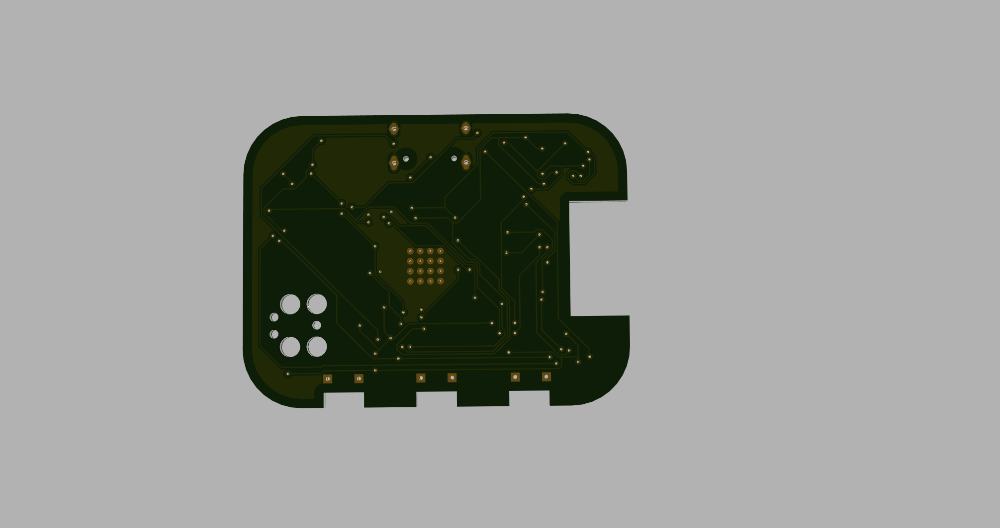

# InkTime - Open Source Smartwatch ⌚

InkTime este un start-up care își propune să creeze un smartwatch accesibil și complet open-source. Acest repository conține fișierele din etapa de Engineering Validation Test (EVT), inclusiv design-ul hardware (schematic + PCB 2D/3D în Fusion 360), fișierele de fabricație și documentația aferentă.

## 1. Diagrama Bloc a Sistemului

Diagrama de mai jos ilustrează arhitectura hardware a ceasului InkTime, având în centru procesorul nRF52840, înconjurat de modulele de power management, senzori și interfața cu utilizatorul.

 

---

## 2. Bill of Materials (BOM)

Toate componentele pasive (rezistențe, condensatoare) sunt în format SMD 0201 sau 0402, conform specificațiilor proiectului. Mai jos sunt componentele integrate principale (IC-urile):

| Componentă / Modul | Rol | JLCPCB Part Link | Datasheet |
| :--- | :--- | :--- | :--- |
| **nRF52840-QIAA** | MCU principal (Bluetooth LE) | [Caută JLC](https://jlcpcb.com/parts) | [Datasheet nRF52840](https://infocenter.nordicsemi.com/pdf/nRF52840_PS_v1.1.pdf) |
| **BQ25180YBGR** | PMIC / LiPo Battery Charger | [Caută JLC](https://jlcpcb.com/parts) | [Datasheet BQ25180](https://www.ti.com/lit/ds/symlink/bq25180.pdf) |
| **RT6160AWSC** | DC/DC Buck-Boost Converter (3.3V) | [Caută JLC](https://jlcpcb.com/parts) | [Datasheet RT6160](https://www.richtek.com/assets/product_file/RT6160A/DS6160A-01.pdf) |
| **MAX17048G+T10** | Fuel Gauge (Monitorizare Baterie) | [Caută JLC](https://jlcpcb.com/parts) | [Datasheet MAX17048](https://datasheets.maximintegrated.com/en/ds/MAX17048-MAX17049.pdf) |
| **BMA421** | Senzor IMU (Accelerometru) | [Caută JLC](https://jlcpcb.com/parts) | [Datasheet BMA421](https://www.bosch-sensortec.com/media/boschsensortec/downloads/datasheets/bst-bma421-fl000.pdf) |
| **DRV2605YZFR** | Haptic Motor Driver | [Caută JLC](https://jlcpcb.com/parts) | [Datasheet DRV2605](https://www.ti.com/lit/ds/symlink/drv2605.pdf) |
| **E-Paper Display** | Conector Display FPC 24-pin | - | - |

---

## 3. Funcționalitate Hardware și Arhitectură

Sistemul este construit în jurul microcontroller-ului **Nordic nRF52840**, ales pentru eficiența energetică ridicată și capabilitățile native Bluetooth Low Energy (BLE). 

### Alimentare (Power Management)
* **Încărcare:** Sistemul folosește un încărcător liniar **BQ25180** compatibil cu baterii LiPo, alimentat prin mufa USB-C (5V). 
* **Regulare:** Deoarece bateria variază între 3.0V și 4.2V, folosim un convertor DC/DC Buck-Boost **RT6160** pentru a menține o tensiune stabilă de 3.3V necesară componentelor logice și display-ului.
* **Monitorizare:** Modulul **MAX17048** comunică prin I2C pentru a oferi SoC-ului informații exacte despre procentajul bateriei (State of Charge).

### Senzori și Interacțiune
* **Membru senzorial:** Un IMU **BMA421** comunică prin I2C cu microcontroller-ul. Folosește pini de interupt pentru a trezi procesorul (Wake-on-Motion), economisind astfel energie (ex: se aprinde display-ul doar când ridici mâna).
* **Display E-Paper:** Este controlat printr-o magistrală SPI (MISO, MOSI, SCK, CS) la care se adaugă semnalele de control specifice ecranelor cu cerneală electronică (BUSY, DC, RESET). Avantajul suprem este că ecranul reține imaginea fără a consuma energie (0mA consum static).
* **Feedback Haptic:** Un driver dedicat **DRV2605** este conectat pe magistrala I2C și controlează un motor de vibrații (shaker) pentru notificări.
* **Input Utilizator:** 3 butoane fizice cu rezistențe de pull-up hardware/software pentru navigarea în meniu.

### Estimări de consum energetic
* **Sleep Mode (System OFF):** ~1.5uA (nRF52840) + curenții de stand-by ai senzorilor = **< 5uA total**.
* **Display Refresh:** ~8mA timp de 1-2 secunde (doar la actualizarea orei).
* **BLE Tx/Rx Active:** ~5.3mA pe vârfuri scurte (câteva milisecunde).
Sistemul este extrem de eficient, asigurând o durată de viață a bateriei de câteva săptămâni, în funcție de frecvența refresh-urilor e-paper.

---

## 4. Maparea Pinilor nRF52840 (Pinout)

| Pin nRF52840 | Nume Semnal | Destinație | Rol / Explicație |
| :--- | :--- | :--- | :--- |
| `P0.xx` | I2C_SDA | BMA421, BQ25180, MAX17048, DRV2605 | Linia de date pentru magistrala I2C comună. |
| `P0.xx` | I2C_SCL | BMA421, BQ25180, MAX17048, DRV2605 | Linia de clock pentru magistrala I2C comună. |
| `P0.xx` | SPI_MOSI | E-Paper Connector | Trimite comenzi și date de imagine către display. |
| `P0.xx` | SPI_SCK | E-Paper Connector | Semnalul de clock pentru interfața SPI a display-ului. |
| `P0.xx` | EPD_CS | E-Paper Connector | Chip Select pentru display. |
| `P0.xx` | EPD_DC | E-Paper Connector | Data/Command - indică dacă payload-ul e comandă sau pixel. |
| `P0.xx` | EPD_BUSY | E-Paper Connector | Citește starea de busy a display-ului în timpul refresh-ului. |
| `P0.xx` | IMU_INT1 | BMA421 | Wake-up interrupt (ex: step counter, wrist tilt). |
| `P0.xx` | SW_UP | Buton Sus | Input navigație (activ low). |
| `P0.xx` | SW_ENT | Buton Enter | Input navigație (activ low). |
| `P0.xx` | SW_DN | Buton Jos | Input navigație (activ low). |

---

## 5. Design Log & Constrângeri pentru Review

### Imagini PCB și Asamblare 3D
*Aici poți vedea design-ul plăcii de circuit și cum se integrează în carcasa printată.*

### Jurnal de decizii (Design Log)
În timpul procesului de proiectare am respectat următoarele constrângeri și decizii de good-practice:
1. **Plane de Masă:** S-au implementat poligoane de GND atât pe layer-ul TOP cât și pe BOTTOM. S-a realizat Via Stitching abundent pentru a asigura un plan de referință solid, în special în apropierea modulului radio și a convertoarelor DC/DC.
2. **Zona Antenei:** Am respectat cu strictețe zona de clearance pentru antena integrată. S-a folosit un "Polygon Cutout" pe ambele straturi pentru a decupa cuprul complet de sub antenă, evitând astfel detunarea (detuning) acesteia și degradarea semnalului RF.
3. **Rutarea curentului:** Traseele de putere (VBUS, 3V3, VBAT) au fost rutate la o grosime optimizată de 0.3mm (unde spațiul a permis) pentru a minimiza căderea de tensiune, iar condensatoarele de decuplare (100nF) au fost amplasate strict, cât mai aproape de pinii de VDD ai integratelor.
4. **Acceptare Erori DRC:** Erorile de clearance și dimension rezultate din depășirea marginii plăcii de către componentele mecanice (mufa USB-C și butoanele fizice) au fost acceptate asumat, deoarece amplasarea lor este impusă de cotele carcasei exterioare.

---
*Proiect realizat pentru etapa de EVT - Aprilie 2026.*